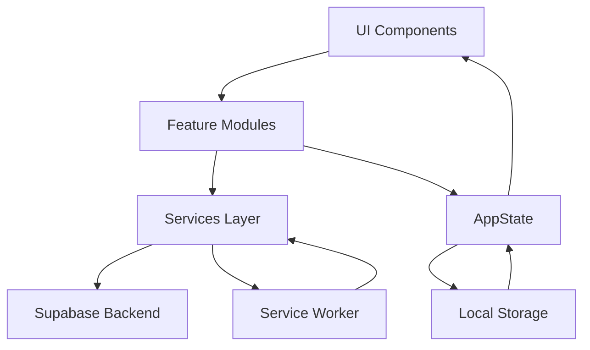

# 🏗️ Arquitetura - App Treino

## 📋 Visão Geral

O App Treino é uma aplicação web progressiva (PWA) construída com JavaScript vanilla, focada em performance, simplicidade e experiência do usuário. A arquitetura segue princípios de modularidade, separação de responsabilidades e escalabilidade.

## 🧩 Estrutura do Projeto

```
app_treino/
├── 📁 .github/              # GitHub templates e workflows
│   ├── ISSUE_TEMPLATE/      # Templates para issues
│   ├── workflows/           # GitHub Actions
│   └── pull_request_template.md
├── 📁 components/           # Componentes reutilizáveis
│   ├── QuickEditModal.js
│   ├── MetricsWidget.js
│   └── avaliacaoTreino.js
├── 📁 feature/              # Features principais
│   ├── dashboard.js         # Dashboard principal
│   ├── planning.js          # Planejamento semanal
│   ├── workoutExecution.js  # Execução de treinos
│   └── login.js             # Autenticação
├── 📁 services/             # Lógica de negócio e APIs
│   ├── supabaseService.js   # Cliente Supabase
│   ├── weeklyPlanningService.js
│   ├── workoutService.js
│   └── userService.js
├── 📁 templates/            # Templates de páginas
│   ├── home.js              # Template da home
│   ├── index.js             # Template principal
│   └── modals.js            # Templates de modais
├── 📁 styles/               # Estilos CSS
│   ├── styles.css           # Estilos principais
│   └── workoutExecution.css
├── 📁 utils/                # Utilitários e helpers
│   ├── icons.js             # Sistema de ícones SVG
│   └── reactiveUI.js        # Utilitários de UI
├── 📁 ui/                   # Componentes de interface
│   ├── navigation.js        # Sistema de navegação
│   └── notifications.js     # Sistema de notificações
├── 📁 js/                   # JavaScript principal
│   └── app.js               # Ponto de entrada
├── 📁 tests/                # Testes automatizados
├── 📁 docs/                 # Documentação
└── 📁 assets/               # Assets estáticos
    ├── icons/
    └── images/
```

## 🎯 Princípios Arquiteturais

### 1. **Modularidade**
- Cada feature é um módulo independente
- Componentes reutilizáveis e isolados
- Separação clara de responsabilidades

### 2. **Vanilla JavaScript**
- Sem frameworks pesados
- Performance otimizada
- Controle total sobre o código

### 3. **Progressive Web App**
- Service Worker para cache
- Manifest para instalação
- Responsivo e mobile-first

### 4. **Estado Centralizado**
- AppState para gerenciamento global
- Estado reativo e previsível
- Sincronização automática

## 🔄 Fluxo de Dados



### Camadas da Arquitetura

1. **Apresentação (UI)**
   - Templates e componentes visuais
   - Gerenciamento de eventos
   - Responsividade e acessibilidade

2. **Lógica de Negócio (Features)**
   - Coordenação entre UI e Services
   - Validação de dados
   - Fluxos de trabalho específicos

3. **Serviços (Services)**
   - Comunicação com backend
   - Cache e persistência local
   - Transformação de dados

4. **Dados (Backend)**
   - Supabase como BaaS
   - Row Level Security
   - Real-time subscriptions

## 🗄️ Gerenciamento de Estado

### AppState
```javascript
// Exemplo de uso do AppState
import AppState from './state/appState.js';

// Definir estado
AppState.set('currentUser', userData);

// Obter estado
const user = AppState.get('currentUser');

// Observar mudanças
AppState.subscribe('workoutPlan', (newPlan) => {
    updateUI(newPlan);
});
```

### Persistência
- **LocalStorage**: Cache local e preferências
- **Supabase**: Dados principais e sincronização
- **SessionStorage**: Estado temporário da sessão

## 🔌 Integração com Backend

### Supabase Configuration
```javascript
// services/supabaseService.js
import { createClient } from '@supabase/supabase-js';

const supabaseUrl = 'https://your-project.supabase.co';
const supabaseKey = 'your-anon-key';

export const supabase = createClient(supabaseUrl, supabaseKey);
```

### Database Schema
```sql
-- Principais tabelas
usuarios (id, nome, email, created_at)
planejamento_semanal (id, usuario_id, ano, semana, dia_semana, tipo_atividade)
exercicios (id, nome, grupo_muscular, equipamento)
treino_executado (id, usuario_id, data_execucao, concluido)
```

## 🎨 Sistema de Componentes

### Ícones SVG
```javascript
// utils/icons.js
import { getWorkoutIcon, getActionIcon } from './utils/icons.js';

// Uso
const playIcon = getActionIcon('play', 'active');
const workoutIcon = getWorkoutIcon('peito', 'large');
```

### Templates Reutilizáveis
```javascript
// templates/components.js
export const createWorkoutCard = (workout) => `
    <div class="workout-card">
        <div class="workout-icon">${getWorkoutIcon(workout.type)}</div>
        <h3>${workout.name}</h3>
        <p>${workout.description}</p>
    </div>
`;
```

## 🚀 Performance

### Otimizações Implementadas

1. **Lazy Loading**
   - Módulos carregados sob demanda
   - Imagens com loading lazy
   - Componentes dinâmicos

2. **Cache Strategy**
   - Service Worker para cache de assets
   - LocalStorage para dados frequentes
   - Cache-first para recursos estáticos

3. **Bundle Optimization**
   - Minificação de CSS/JS
   - Tree shaking automático
   - Compressão de imagens

### Métricas de Performance
```javascript
// Performance monitoring
const perfObserver = new PerformanceObserver((list) => {
    list.getEntries().forEach((entry) => {
        console.log(`${entry.name}: ${entry.duration}ms`);
    });
});

perfObserver.observe({ entryTypes: ['measure', 'navigation'] });
```

## 🔒 Segurança

### Autenticação e Autorização
- JWT tokens com Supabase Auth
- Row Level Security (RLS)
- Validação client-side e server-side

### Proteção de Dados
```javascript
// Sanitização de entrada
const sanitizeInput = (input) => {
    return input.trim().replace(/<script\b[^<]*(?:(?!<\/script>)<[^<]*)*<\/script>/gi, '');
};
```

### Headers de Segurança
```javascript
// Content Security Policy
const csp = "default-src 'self'; script-src 'self' 'unsafe-inline'";
document.querySelector('meta[http-equiv="Content-Security-Policy"]').content = csp;
```

## 📱 Responsividade

### Breakpoints
```css
/* Mobile First */
@media (min-width: 768px) { /* Tablet */ }
@media (min-width: 1024px) { /* Desktop */ }
@media (min-width: 1440px) { /* Large Desktop */ }
```

### Grid System
```css
.container {
    display: grid;
    grid-template-columns: repeat(auto-fit, minmax(300px, 1fr));
    gap: 1rem;
}
```

## 🧪 Testing Strategy

### Estrutura de Testes
```
tests/
├── unit/              # Testes unitários
├── integration/       # Testes de integração
├── e2e/              # Testes end-to-end
└── setup.js          # Configuração dos testes
```

### Exemplo de Teste
```javascript
// tests/unit/workoutService.test.js
import { calculateWorkoutStats } from '../services/workoutService.js';

describe('WorkoutService', () => {
    test('should calculate total duration correctly', () => {
        const exercises = [
            { duration: 300, calories: 50 },
            { duration: 600, calories: 100 }
        ];
        
        const result = calculateWorkoutStats(exercises);
        
        expect(result.totalDuration).toBe(900);
        expect(result.totalCalories).toBe(150);
    });
});
```

## 🔄 CI/CD Pipeline

### GitHub Actions Workflow
```yaml
# .github/workflows/ci.yml
name: CI/CD Pipeline
on: [push, pull_request]

jobs:
  test:
    runs-on: ubuntu-latest
    steps:
      - uses: actions/checkout@v4
      - name: Run tests
        run: npm test
      
  build:
    runs-on: ubuntu-latest
    steps:
      - uses: actions/checkout@v4
      - name: Build
        run: npm run build
```

## 🚢 Deployment

### Ambientes
- **Development**: Local development server
- **Staging**: Preview deployments via Vercel/Netlify
- **Production**: GitHub Pages ou Vercel

### Build Process
```bash
npm run build         # Build otimizado
npm run lighthouse    # Auditoria de performance
npm run test         # Validação de qualidade
npm run deploy       # Deploy para produção
```

## 📈 Monitoramento

### Analytics e Métricas
- Performance metrics via Lighthouse
- User analytics via Google Analytics
- Error tracking via Sentry

### Health Checks
```javascript
// Health check endpoint
const healthCheck = async () => {
    try {
        const response = await fetch('/api/health');
        return response.ok;
    } catch {
        return false;
    }
};
```

## 🔮 Roadmap Técnico

### Próximas Melhorias
- [ ] Migration para TypeScript
- [ ] Implementação de Web Workers
- [ ] Offline-first architecture
- [ ] Real-time collaboration
- [ ] Advanced PWA features

### Versões Planejadas
- **v6.0**: Redesign completo da arquitetura
- **v6.1**: TypeScript migration
- **v6.2**: Advanced PWA features
- **v7.0**: Real-time collaboration

---

**Esta documentação é atualizada continuamente para refletir o estado atual da arquitetura.** 🏗️