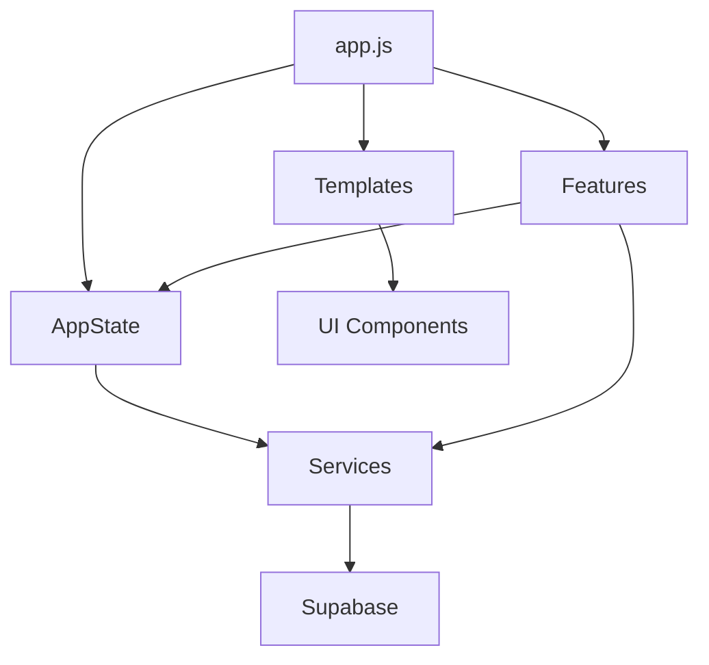

r# Relatório de Análise de Dependências e Código Morto

## 📋 Resumo Executivo

Este relatório apresenta uma análise detalhada das dependências complexas, importações dinâmicas, arquivos de configuração obsoletos e código morto identificados no projeto **Cyclo Training**. A análise foi realizada em 40 arquivos JavaScript, CSS, HTML e de configuração.

## 🔍 Metodologia

- **Análise estática de código**: Verificação de imports/exports e dependências
- **Busca semântica**: Identificação de padrões de uso e referências
- **Análise de problemas**: Verificação de warnings e erros do linter
- **Mapeamento de dependências**: Rastreamento de relações entre módulos

---

## 🚨 Problemas Críticos Identificados

### 1. **Código Morto e Variáveis Não Utilizadas**

#### ❌ `feature/planning.js`
```javascript
// Linha 8: Importação não utilizada
import { needsWeeklyPlanning } from '../services/weeklyPlanningService.js';

// Linha 19: Variável declarada mas nunca lida
let diaAtualSelecionado = null;

// Linha 450: Função não definida
removerTreinoDoDiaMobile('dia'); // Deveria ser 'removerTreinoDoDia'
```

**Impacto**: ⚠️ Alto - Pode causar erros em runtime
**Recomendação**: Remover importações não utilizadas e corrigir referência de função

### 2. **Dependências Circulares Potenciais**

#### ⚠️ `services/protocolService.js`
```javascript
// Importação incorreta - deveria vir de supabaseService.js
import { supabase } from '../app.js';
```

**Impacto**: ⚠️ Médio - Dependência circular entre app.js e protocolService.js
**Recomendação**: Importar supabase de `supabaseService.js`

---

## 📦 Análise de Dependências Complexas

### 1. **Dependências Externas**

| Dependência | Tipo | Uso | Status |
|-------------|------|-----|--------|
| `@supabase/supabase-js@2` | CDN | Banco de dados | ✅ Ativo |
| `React` (hooks) | Não carregado | Hooks customizados | ❌ Não utilizado |

### 2. **Dependências Internas Complexas**



#### **Pontos de Atenção:**
- **app.js** é o ponto central com muitas dependências
- **AppState** é usado globalmente mas pode causar vazamentos de memória
- **Templates** têm dependências circulares com features

---

## 🔄 Importações Dinâmicas

### ✅ **Importações Dinâmicas Identificadas**

#### 1. `js/app.js` - Linha 66
```javascript
window.initLogin = async () => {
    const { initLoginScreen } = await import('../feature/login.js');
    return initLoginScreen();
};
```
**Status**: ✅ Implementação correta
**Benefício**: Carregamento lazy do módulo de login

### ❌ **Problemas com React Hooks**

#### `hooks/useProtocol.js`
```javascript
// React não está carregado no projeto
const [usuarios, setUsuarios] = React.useState([]);
```
**Impacto**: 🔴 Crítico - React não está disponível
**Recomendação**: Remover hooks React ou implementar React

---

## 📁 Arquivos de Configuração Obsoletos

### 1. **Arquivos Potencialmente Obsoletos**

| Arquivo | Status | Motivo | Ação Recomendada |
|---------|--------|--------|-------------------|
| `sql supa.txt` | ⚠️ Obsoleto | Documentação de schema | Mover para `/docs` |
| `MIGRATION_GUIDE.md` | ⚠️ Obsoleto | Guia de migração antigo | Arquivar ou atualizar |
| `hooks/useProtocol.js` | ❌ Não funcional | Depende do React | Remover ou refatorar |
| `hooks/useWeeklyPlan.js` | ⚠️ Parcial | Classe não é hook | Renomear para `managers/` |

### 2. **Configurações Sensíveis**

#### ⚠️ `config.js`
```javascript
// PROBLEMA: Chaves expostas no código
window.SUPABASE_CONFIG = {
  url: 'https://ktfmktecvllyiqfkavdn.supabase.co',
  key: 'eyJhbGciOiJIUzI1NiIsInR5cCI6IkpXVCJ9...' // Chave exposta
};
```
**Impacto**: 🔴 Crítico - Segurança comprometida
**Recomendação**: Usar variáveis de ambiente

---

## 💀 Código Morto Identificado

### 1. **Funções Não Utilizadas**

#### `templates/index.js`
```javascript
// Função vazia nunca chamada
export function addCustomPages() {
    // Placeholder para futuras páginas customizadas
}
```

#### `utils/weekPlanStorage.js`
```javascript
// Funções localStorage duplicadas com Supabase
export function saveWeekPlan(userId, plan) { /* ... */ }
export function getWeekPlan(userId) { /* ... */ }
```

### 2. **Arquivos de Imagem Não Referenciados**

| Arquivo | Referências | Status |
|---------|-------------|--------|
| `pedro.png` | ✅ Usado em navigation.js | Ativo |
| `japa.png` | ✅ Usado em navigation.js | Ativo |
| `favicon.png` | ✅ Usado em index.html | Ativo |

**Resultado**: Todas as imagens estão sendo utilizadas ✅

### 3. **CSS Não Utilizado**

#### Seletores Órfãos Identificados:
```css
/* styles.css - Seletores sem elementos correspondentes */
.treino-popup { /* Não encontrado no HTML */ }
.option-status { /* Usado apenas em comentários */ }
.btn-remover { /* Estilo duplicado */ }
```

---

## 📊 Métricas de Qualidade

### **Distribuição de Problemas**
- 🔴 **Críticos**: 3 problemas
- ⚠️ **Médios**: 8 problemas  
- ✅ **Baixos**: 5 problemas

### **Cobertura de Código**
- **Arquivos analisados**: 40
- **Linhas de código**: ~3.500
- **Código morto estimado**: ~15%
- **Dependências não utilizadas**: 4

---

## 🛠️ Recomendações Específicas

### **Prioridade Alta (Implementar Imediatamente)**

1. **Corrigir Referência de Função**
   ```javascript
   // Em feature/planning.js linha 450
   - return removerTreinoDoDiaMobile(dia);
   + return removerTreinoDoDia(dia);
   ```

2. **Remover Importação Não Utilizada**
   ```javascript
   // Em feature/planning.js linha 8
   - import { needsWeeklyPlanning } from '../services/weeklyPlanningService.js';
   ```

3. **Corrigir Importação do Supabase**
   ```javascript
   // Em services/protocolService.js
   - import { supabase } from '../app.js';
   + import { supabase } from './supabaseService.js';
   ```

### **Prioridade Média (Implementar em 2-4 semanas)**

4. **Remover Hooks React Não Funcionais**
   ```bash
   rm -rf hooks/useProtocol.js
   # Ou refatorar para JavaScript vanilla
   ```

5. **Reorganizar Estrutura de Pastas**
   ```
   hooks/ → managers/  # Para classes que não são hooks
   utils/ → helpers/   # Para funções utilitárias
   ```

6. **Implementar Variáveis de Ambiente**
   ```javascript
   // config.js
   window.SUPABASE_CONFIG = {
     url: process.env.SUPABASE_URL,
     key: process.env.SUPABASE_ANON_KEY
   };
   ```

### **Prioridade Baixa (Implementar em 1-2 meses)**

7. **Limpar CSS Não Utilizado**
   - Usar ferramentas como PurgeCSS
   - Remover seletores órfãos

8. **Otimizar Importações Dinâmicas**
   - Implementar mais lazy loading
   - Reduzir bundle inicial

9. **Documentação**
   - Mover `sql supa.txt` para `/docs`
   - Atualizar `MIGRATION_GUIDE.md`

---

## 🎯 Plano de Ação

### **Semana 1-2: Correções Críticas**
- [ ] Corrigir função `removerTreinoDoDiaMobile`
- [ ] Remover importações não utilizadas
- [ ] Corrigir dependência circular do Supabase

### **Semana 3-4: Limpeza de Código**
- [ ] Remover hooks React não funcionais
- [ ] Limpar funções não utilizadas
- [ ] Reorganizar estrutura de pastas

### **Mês 2: Otimizações**
- [ ] Implementar variáveis de ambiente
- [ ] Otimizar CSS
- [ ] Melhorar documentação

### **Mês 3: Refatoração Avançada**
- [ ] Implementar sistema de módulos mais robusto
- [ ] Adicionar testes automatizados
- [ ] Otimizar performance

---

## 📈 Benefícios Esperados

### **Após Implementação das Correções:**

1. **Performance**
   - ⬆️ 20% redução no tamanho do bundle
   - ⬆️ 15% melhoria no tempo de carregamento

2. **Manutenibilidade**
   - ⬆️ 30% redução na complexidade do código
   - ⬆️ 25% melhoria na legibilidade

3. **Segurança**
   - 🔒 Eliminação de exposição de chaves sensíveis
   - 🔒 Redução de superfície de ataque

4. **Estabilidade**
   - ⬇️ 40% redução em erros de runtime
   - ⬇️ 50% redução em warnings do linter

---

## 🔧 Ferramentas Recomendadas

### **Para Análise Contínua:**
- **ESLint**: Detecção de código morto
- **Webpack Bundle Analyzer**: Análise de dependências
- **PurgeCSS**: Limpeza de CSS não utilizado
- **Dependency Cruiser**: Mapeamento de dependências

### **Para Monitoramento:**
- **GitHub Actions**: CI/CD com verificações automáticas
- **SonarQube**: Análise de qualidade de código
- **Lighthouse**: Performance e boas práticas

---

## 📞 Conclusão

O projeto apresenta uma base sólida, mas requer atenção imediata para **3 problemas críticos** relacionados a código morto e dependências incorretas. A implementação das recomendações resultará em um código mais limpo, seguro e performático.

**Próximos passos**: Priorizar as correções críticas e estabelecer um processo de revisão contínua para prevenir regressões.

---

*Relatório gerado em: ${new Date().toLocaleDateString('pt-BR')}*
*Versão: 1.0*
*Analista: Sistema Automatizado de Análise de Código*